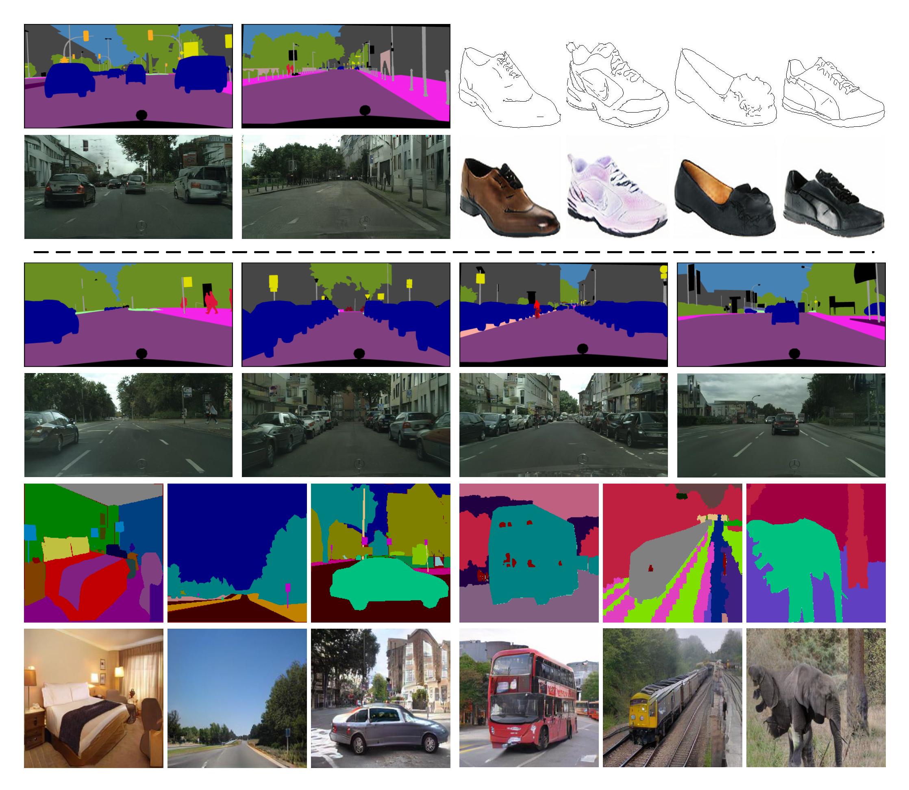

# Lab2Pix-V2
Label-Guided Generative Adversarial Network for Realistic Image Synthesis



Label-Guided Generative Adversarial Network for Realistic Image Synthesis

## Installztion
Clone this repo.

```bash
git clone https://github.com/RoseRollZhu/Lab2Pix-V2.git
cd Lab2Pix-V2/
```

This code requires PyTorch framework and CUDA environment. PyTorch 1.6.0 + and python 3.7.0 + with Anaconda environment are recommonded. Please install dependencies by

```bash
pip install -r requirements.txt
```

## Dataset
All the datasets used in this research must be downloaded beforehand.

**Cityscapes Dataset** can be downloaded [here](https://www.cityscapes-dataset.com/). In particular, you will need to download leftImg8bit_trainvaltest.zip, gtFine_trainvaltest.zip. The images and labels should be arranged as below:

```
Lab2Pix
|───datasets
|   |───cityscapes
|   |   |───leftImg8bit
|   |   |   |───train
|   |   |   |   |───aachen
|   |   |   |   |   |───aachen_000000_000019_leftImg8bit.png
|   |   |   |───val
|   |   |   |   |───frankfurt
|   |   |   |   |   |───frankfurt_000000_000294_leftImg8bit.png
|   |   |───gtFine
|   |   |   |───train
|   |   |   |   |───aachen
|   |   |   |   |   |───aachen_000000_000019_gtFine_color.png
|   |   |   |   |   |───aachen_000000_000019_gtFine_labelIds.png
|   |   |   |───val
|   |   |   |   |───frankfurt
|   |   |   |   |   |───frankfurt_000000_000294_gtFine_color.png
|   |   |   |   |   |───frankfurt_000000_000294_gtFine_labelIds.png
```

**ADE20K Dataset** can be downloaded following the [website](https://groups.csail.mit.edu/vision/datasets/ADE20K/). The images and labels should be arranged as below:

```
Lab2Pix
|───datasets
|   |───ade20k
|   |   |───annotations
|   |   |   |───training
|   |   |   |   |───ADE_train_00000001.png
|   |   |   |───validation
|   |   |   |   |───ADE_val_00000001.png
|   |   |───images
|   |   |   |───training
|   |   |   |   |───ADE_train_00000001.jpg
|   |   |   |───validation
|   |   |   |   |───ADE_val_00000001.jpg
```

**COCO-Stuff Dataset** can be downloaded following the [website](https://cocodataset.org). You are supposed to download train2017.zip, val2017.zip, stuffthingmaps_trainval2017.zip, and annotations_trainval2017.zip. The file structure should be arranged as below: 
```
Lab2Pix
|───datasets
|   |───coco_stuff
|   |   |───train_img
|   |   |   |───000000000009.jpg
|   |   |───train_inst
|   |   |   |───000000000009.png
|   |   |───train_label
|   |   |   |───000000000009.png
|   |   |───val_img
|   |   |   |───000000000139.jpg
|   |   |───val_inst
|   |   |   |───000000000139.png
|   |   |───val_label
|   |   |   |───000000000139.png
```
You may find ```datasets/coco_generate_instance_map.py``` helpful. ```pycocotools``` is needed for this preprocessing code.

## Train Models
Before you train new models, make sure you have prepared the datasets in proper structure. If you place dataset in other direction, you can use ```--dataroot [path to dataset]``` to specify the correct direction. Note that, the dataset root filename like 'cityscapes' can not be renamed. You can also change the save path of the checkpoints by specifying ```--checkpoints_dir [path to checkpoints]```. The model will automatically continue training when the checkpoint is saved in the target direction.

Then you can train your model
```bash
# To train on cityscapes with four GPUs, for example
CUDA_VISIBLE_DEVICES=0,1,2,3 python -m torch.distributed.launch --nproc_per_node=4 train.py --name Lab2PixV2-cityscapes --batchSize 20 --dataroot ./datasets/cityscapes --dataset_mode cityscapes --niter 100 --niter_decay 100 --gpu_ids 0,1,2,3
```
--opt_level O1
If you have other number of GPUs, you can use ```--nproc_per_node [GPU number]``` and ```--gpu_ids [GPU ids split with ","]``` to specify multi GPUs working (e.g. for 2 GPUs ```--nproc_per_node 2``` and ```--gpu_ids 0,1```) and you can adjust the batch size ```--batchSize [batch size number]``` according to your devices. Note that, single GPU is also supported. If your GPUs (e.g. RTX TITAN, Tesla V100, RTX 3090, Tesla A100) have tensor cores, you can use half-precision mode for training with specifying ```--ope_level O1```. Note that, half-precision will significantly accerlate the training, but the final results will be slightly worse.

## Test Models
If you have trained a model, you can test it with the following commond
```bash
# To test on cityscapes, for example
CUDA_VISIBLE_DEVICES=0 python -m torch.distributed.launch --nproc_per_node=1 test.py --name Lab2PixV1_pretrained_cityscapes --dataroot ./datasets/cityscapes  --results_dir ./results/Lab2PixV1_pretrained_cityscapes
```

Note that test code is only supported for single GPU. If you don't want to test all samples in datasets, you can specify ```--max_test_num [the max number of the test]```. By default, the progress loads the latest checkpoint. It can be changed using ```--which_epoch [epoch number]```. You can obtain our generated samples on [Cityscapes(512x256)](https://drive.google.com/file/d/1GR7FwJqe_o-zzBukwUw5QeKj25yWj8Mk/view?usp=sharing), [Cityscapes-H(1024x512)](https://drive.google.com/file/d/1qSYIrxLaUd9f9LPdaVEKij69WNFUsY4I/view?usp=sharing), [ADE20K(256x256)](https://drive.google.com/file/d/1IRwZACLJWcgB0nhzHH4JyZTrhMr4vlqX/view?usp=sharing) and [COCO-Stuff(256x256)](https://drive.google.com/file/d/17qIfN7l14bHHDp_uWEhfYmQfZdzZn1mC/view?usp=sharing).

## Citation
If you use this code or find this work helpful for your research, please cite our papers.
```
@inproceedings{GaoZSZS20,
  author    = {Lianli Gao and
               Junchen Zhu and
               Jingkuan Song and
               Feng Zheng and
               Heng Tao Shen},
  title     = {Lab2Pix: Label-Adaptive Generative Adversarial Network for Unsupervised
               Image Synthesis},
  booktitle = {{MM} '20: The 28th {ACM} International Conference on Multimedia, Virtual
               Event / Seattle, WA, USA, October 12-16, 2020},
  pages     = {3734--3742},
  year      = {2020}
}
```
## Acknowledgments
This code borrows heavily from [SPADE](https://github.com/NVlabs/SPADE). We thank them for their excellent works in research and code.

